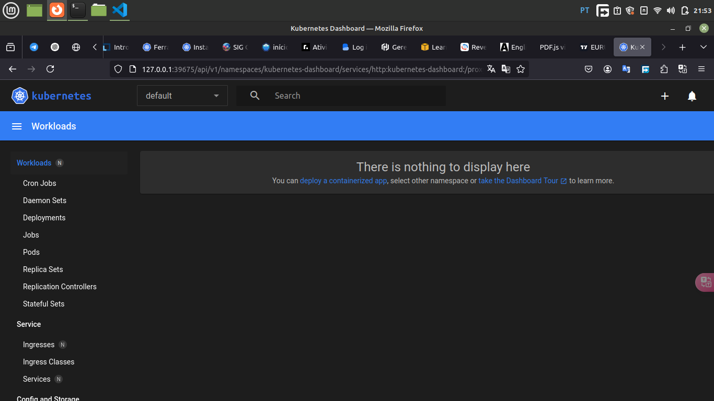

# Deploy a Standalone App

## Deploying uma aplicação usando Dashboard

```bash
$ minikube start
```

```bash
$ minikube status
```

```bash
$ minikube dashboard
```

<div align="center">
    
</div>

## Deploying uma aplicação usando CLI

Vamos primeiro remover o Deployment criado.

```bash
$ kubectl delete deployments web-dash
```

```bash
$ kubectl create deployment webserver \
--image=nginx:alpine --replicas=3 --port=80 \
--dry-run=client -o yaml > webserver.yaml
```

```bash
$ kubectl apply -f webserver.yaml
```

```bash
$ kubectl get replicasets
```

```bash
$ kubectl get pods
```

Alternativamente podemos rodar o Deployment de forma imperativa:

```bash
$ kubectl create deployment webserver --image=nginx:alpine --replicas=3 --port=80
```

## Expondo a aplicação

```bash
$ kubectl apply -f webserver-svc.yaml
```

```bash
$ kubectl expose deployment webserver --name=web-service --type=NodePort
```

```bash
$ kubectl get services
```

```
$ kubectl describe service web-service
```

```bash
$ kubectl get po -l app=nginx -o wide
$ kubectl get ep web-service
```

## Acessando a aplicação

```bash
$ minikube ip
```

```bash
$ minikube service web-service
```

```bash
$ kubectl port-forward svc/web-service 8080:80
```

```bash
$ kubectl expose deployment webserver --name=web-lb --type=LoadBalancer --port=8080
$ minikube tunnel
$ kubectl get services
```

## Liveness, Readness and Startup Probe

### Liveness

O [Liveness](https://kubernetes.io/docs/tasks/configure-pod-container/configure-liveness-readiness-startup-probes/#define-a-liveness-command) Probe pode ser definido:

- Liveness command
- Liveness HTTP request
- TCP Liveness probe
- gRPC Liveness probe

[Manifest Liveness](./liveness-pod.yaml)

### Readness

[Readness](https://kubernetes.io/docs/tasks/configure-pod-container/configure-liveness-readiness-startup-probes/#define-readiness-probes) Probe também pode ser definido:

- Readiness command
- Readiness HTTP request
- TCP readiness probe
- gRPC readiness probe

[Manifest Readness](readness-pod.yaml)

### Startup Probe

[Startup Probe](https://kubernetes.io/docs/tasks/configure-pod-container/configure-liveness-readiness-startup-probes/#define-startup-probes)